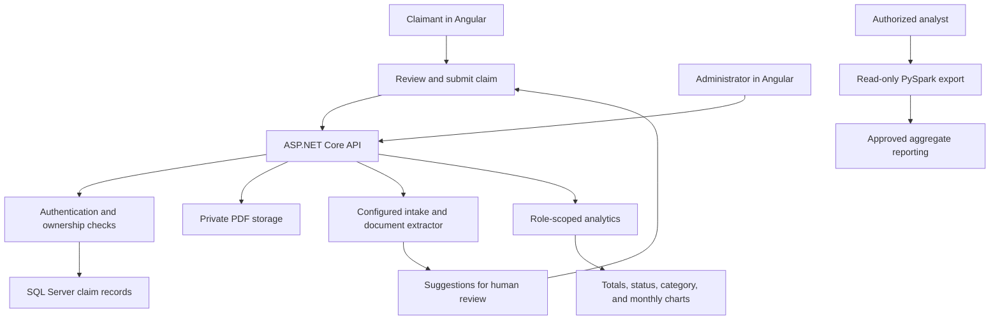
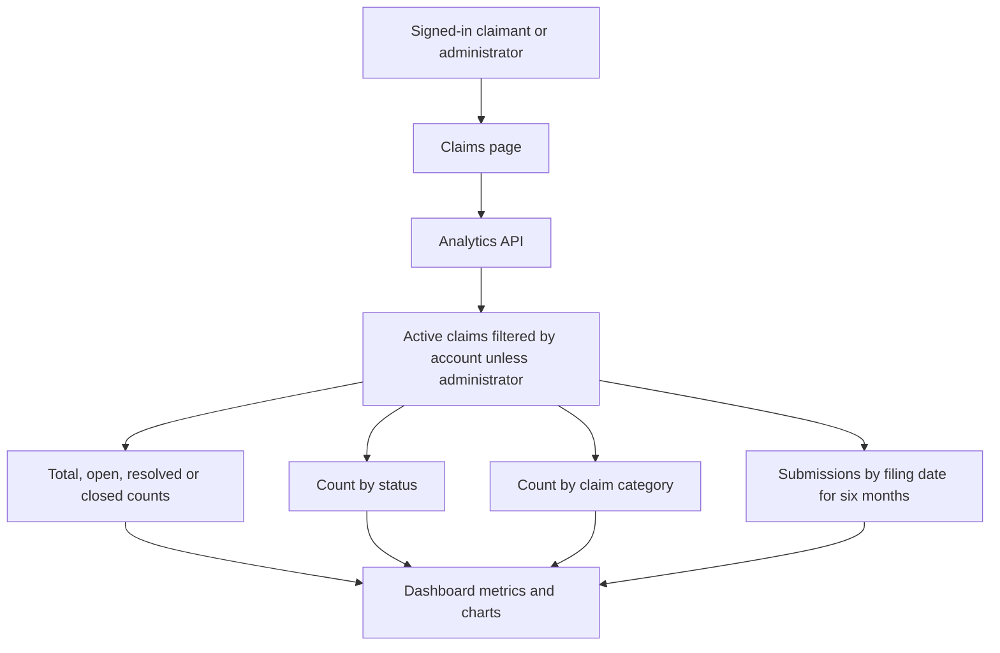
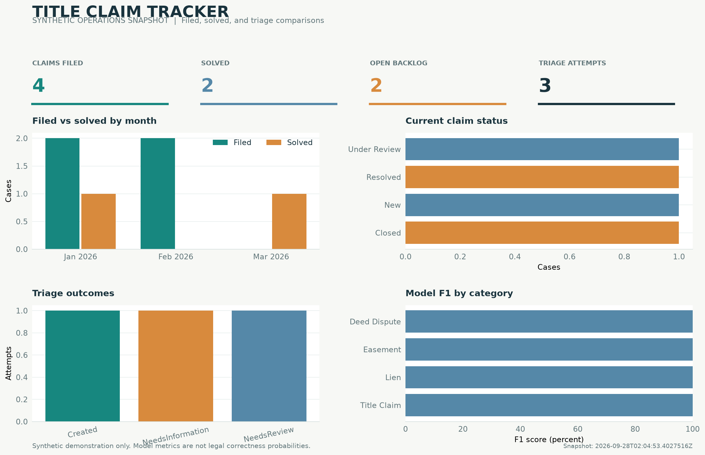

# Title Claim Tracker

## Introduction

Title Claim Tracker is a local-first application for submitting and reviewing property title claims. Claimants manage their own claim records and supporting PDFs. Administrators review claims, update status, analyze document text, and see operational analytics. The application assists recordkeeping; it does not decide legal rights or file documents with a court.

## Tech Stack

- ASP.NET Core 8 Web API, ASP.NET Core Identity, and Entity Framework Core 8.
- Angular 17 and TypeScript.
- SQL Server with reviewed, script-managed schema upgrades.
- ML.NET classification and deterministic intake extraction; optional Python extraction service.
- PdfPig for administrator-requested PDF text extraction; PySpark for separate opt-in analytics exports.

## Technical Architecture and Flow Diagram



The API applies authentication and claim ownership before returning records or analytics. Claimants receive their own active claims; administrators can review active claims across users. Model scores are administrator-only and are not legal correctness probabilities. Public-record data and synthetic analytics fixtures are separate from claimant-submitted claims.

### Analytics Flow and Interpretation



The figures describe active application claims, not ACRIS documents, generated CSVs, or model accuracy. “Open” excludes `Resolved` and `Closed`; monthly filed counts use `DateFiled`, while solved counts use the first recorded transition to `Resolved` or `Closed`. The **Analytics** link is available after sign-in. Claimants see only their own active claims; administrators see active claims across accounts.

The static preview below uses the separate synthetic analytics fixture. It is not live data from signed-in accounts.



## Implementation Steps

Use a disposable development database. The application does not create a database or run schema upgrades at startup.

1. Install .NET 8, Node.js 20+, SQL Server 2016 SP1+ (compatibility level 130+), and SSMS. Python is needed only for optional Python and analytics tests.
2. Provision or restore a development database. Follow [DatabaseSetup.md](TitleClaimTracker/Database/DatabaseSetup.md) for the existing SQL Server schema. Apply the canonical 2.0.3 upgrade only when needed. Apply the separate 2.0.4 script only if you want PDF attachments and document analysis. Never run archived SQL scripts.
3. From the repository root, configure the development connection string and start the API:

   ```powershell
   $env:ConnectionStrings__DefaultConnection = 'Server=localhost\SQLEXPRESS01;Database=TitleClaimTracker;Integrated Security=True;TrustServerCertificate=True;'
   dotnet run --project .\TitleClaimTracker\ClaimTracker\TitleClaimTracker.csproj
   ```

   The launch profile serves HTTPS on port `58021` and HTTP on `58022`. Use your own SQL Server instance and development database name.
   To enable password recovery, provide `Email__Smtp__Host`, `Email__Smtp__Port`, `Email__Smtp__Username`, `Email__Smtp__Password`, and `Email__Smtp__FromAddress` through environment variables or a secret store before starting the API. Optional settings are `Email__Smtp__FromName` and `Email__Smtp__UseSslOnConnect` (`true` for implicit TLS, typically port 465; otherwise STARTTLS, typically port 587). Set `PasswordReset__ClientBaseUrl` to the Angular app's public origin outside local development. Recovery requests return a configuration error until the required SMTP settings are supplied. Never commit SMTP credentials.
4. In a second terminal, install and start Angular:

   ```powershell
   Push-Location .\TitleClaimTracker\ClientApp
   npm ci
   npm start
   ```

   Open [http://localhost:4200](http://localhost:4200). The Angular proxy forwards API and health requests to port `58021`.
5. Register a claimant test account and create several fictional claims with different categories. Register a second claimant and create another claim. Open **Claims** to see the first user’s analytics, then sign in as the second user to confirm the counts are private. Provision an administrator only through the external bootstrap settings documented in [DatabaseSetup.md](TitleClaimTracker/Database/DatabaseSetup.md); use it to compare cross-account analytics and change claim statuses.
6. With schema 2.0.4 installed, attach a selectable-text PDF to a claim. As an administrator, open that claim, download the attachment, and choose **Analyze document**. Scanned PDFs are not OCR-processed.
7. Run the automated checks from the repository root:

   ```powershell
   dotnet test .\TitleClaimTracker.Tests\Backend\TitleClaimTracker.Tests.csproj
   Push-Location .\TitleClaimTracker\ClientApp
   npm run build
   Pop-Location
   ```

The synthetic portfolio generator writes CSV files only; it does not seed the application database or change dashboard counts. The [Analytics README](TitleClaimTracker/Analytics/README.md) explains the offline demo and SQL-backed export separately.

## Future Scope

- Add browser-driven claimant and administrator journeys and SQL Server integration tests against a disposable database.
- Evaluate and calibrate classification with representative, reviewed data before connecting it to live decisions.
- Add OCR for scanned PDFs with explicit privacy, quality, and retention controls.
- Run and reconcile the opt-in SQL/PySpark export in an approved environment, then build Tableau views from approved aggregates.
- Keep production deployment and database changes behind separate review and approval.

See [docs/README.md](docs/README.md) for the application, data, analytics, and database guides.
