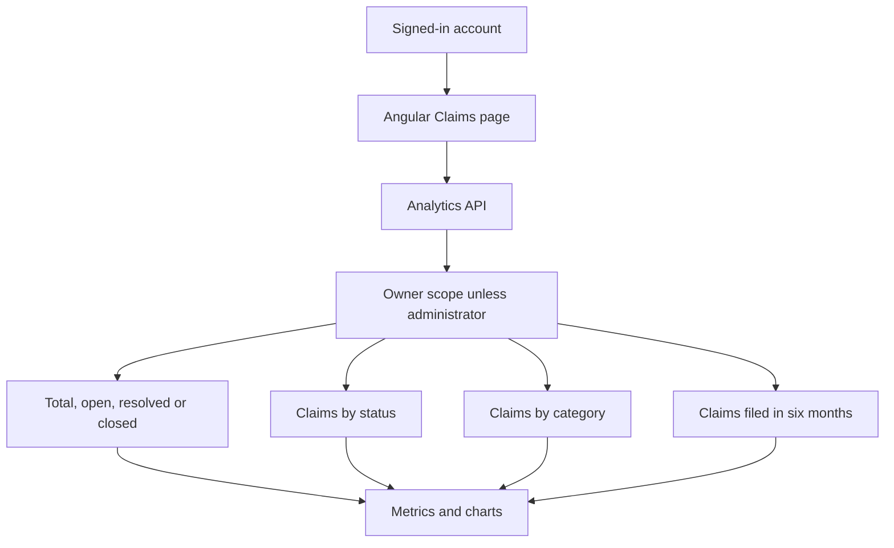

# Analytics Data Products

- This project has two separate analytics paths: live role-scoped charts in the Angular Claims page, and optional offline exports under this directory.

## Live Claims Analytics

Sign in and open **Claims**. The charts are produced by `GET /api/filings/analytics`; the API filters active records to the current claimant and returns all active claimants' records only to an administrator.



The ownership filter runs before aggregation so another claimant's records do not affect a claimant's chart. Open counts exclude `Resolved` and `Closed`; category and status counts use active claims; monthly counts use `DateFiled` for the current and previous five calendar months. These are operational workflow counts, not legal outcomes or model-quality measures.

To test the charts, register two claimant accounts and create several fictional claims through the intake page. Sign in as each account and compare totals. Then use an administrator account to change statuses and confirm the admin sees the combined active claims and updated status counts. The synthetic CSV generator below does not seed SQL Server and will not change these charts.

## Offline Synthetic Demo

Run from the repository root:

```powershell
pwsh -File .\TitleClaimTracker\Analytics\Scripts\Prepare-Analytics.ps1
```

The PowerShell preparer writes fictional CSVs under `TitleClaimTracker/Analytics/Data/Prepared/` and a quality report under `TitleClaimTracker/Analytics/outputs/`. It overwrites generated outputs and does not query or update SQL Server. These files are not measured live activity.

## Optional SQL/PySpark Export

The PySpark runner reads allowlisted fields through a read-only SQL login. It excludes claimant names, narratives, extracted personal text, raw payloads, and user identifiers; source keys are pseudonymized per run. Its output contains operational data and is not approved for Tableau Public.

This path requires Java 17+, the analytics Python dependencies, the Microsoft SQL Server JDBC JAR, and an approved read-only account. Set `TCT_ANALYTICS_JDBC_URL`, `TCT_ANALYTICS_JDBC_USER`, `TCT_ANALYTICS_JDBC_PASSWORD`, and `TCT_SQLSERVER_JDBC_JAR` through the current process or a secret manager. Never commit credentials.

```powershell
Push-Location .\TitleClaimTracker\Analytics
python -m pip install -e ".[test]"
python -m pytest -q -p no:cacheprovider
Pop-Location
python .\TitleClaimTracker\Analytics\pyspark_pipeline.py --confirm-read-only-export
```

The explicit confirmation flag is required before a connection attempt. The runner does not write to SQL Server. Runtime export needs a separately approved environment; the local test command validates query and privacy rules only.

Use `DataDictionary.md`, `MetricsDefinitions.md`, and `Tableau/PrepFlowInstructions.md` for dataset fields and worksheet definitions. Aggregate status history before joining it to claims, and publish only reviewed synthetic data to Tableau Public.
