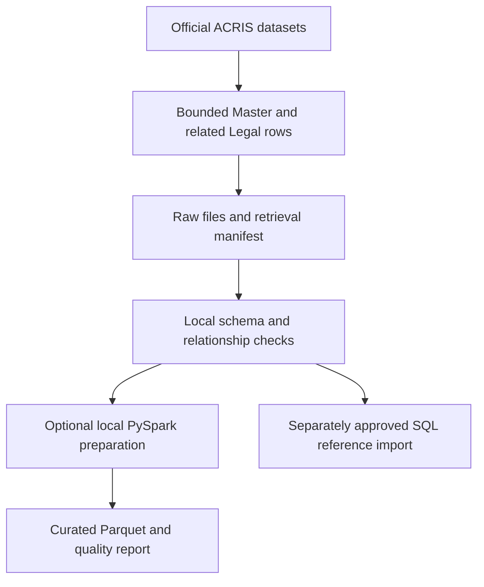

# NYC ACRIS Public Data Track

- This workflow retrieves a bounded sample from the official NYC Open Data ACRIS datasets. These public records describe recorded documents; they are not Title Claim Tracker submissions, dispute labels, or legal outcomes.



The manifest in [sources.json](Manifests/sources.json) records dataset identifiers. The downloader records retrieval time, selection, row counts, hashes, and token use. Master selection is bounded to 100,000 rows and related Legal rows are fetched in pages. A document can relate to multiple parcel keys.

## Download and Validate

Run from the repository root:

```powershell
.\TitleClaimTracker\Data\Public\Scripts\Invoke-AcrisFoundation.ps1 -Mode Download -MasterLimit 100000
.\TitleClaimTracker\Data\Public\Scripts\Invoke-AcrisFoundation.ps1 -Mode Validate
```

Download contacts Socrata and may create large local files. Validate reads local files only. Keep the retrieval manifest with the snapshot because source data can change. Supply an optional `SOCRATA_APP_TOKEN` outside source control if needed.

## Optional Import and Spark Processing

The SQL importer requires an explicitly selected development database, an externally supplied connection string, and `-ConfirmImport`. It upserts public-reference and ingestion tables only; it does not write application claims, properties, filing types, or Identity records. Review the validation report and obtain approval before import.

The PySpark pipeline prepares local Parquet outputs and a development-only document-type model. It does not connect to SQL Server. Run it only after the source snapshot passes validation, with Java 17+ and the optional analytics dependencies installed:

```powershell
python .\TitleClaimTracker\Analytics\acris_spark_pipeline.py --confirm-local-processing
```

Outputs go to `TitleClaimTracker/Analytics/outputs/acris-spark-run/`; an existing run is not overwritten. This bounded sample does not establish production model performance. Keep connection strings, app tokens, and large raw downloads out of Git.