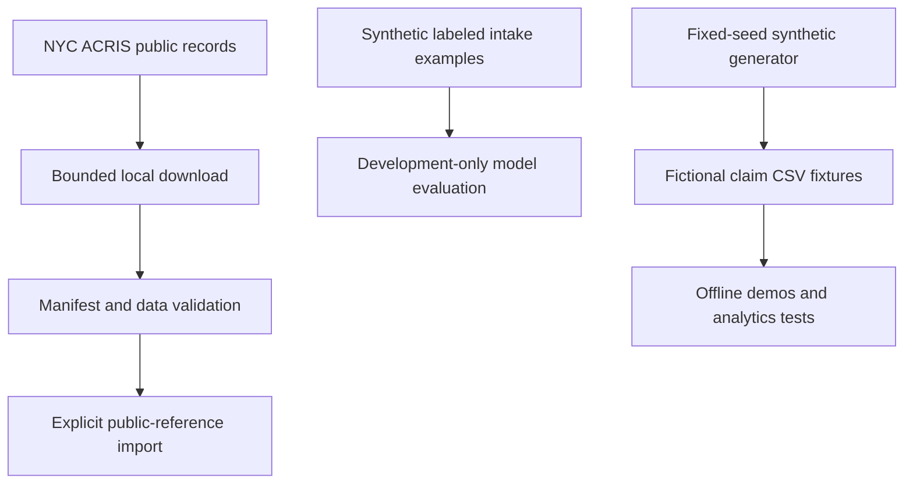

# Project Data Foundation

- This directory keeps public ACRIS records, ML labeling samples, and synthetic claim fixtures in separate tracks. None of these files is automatically inserted into application claims.



The tracks stay separate because public documents are not application claims or dispute labels, and synthetic examples are not evidence of production model quality.

## Commands

Run from the repository root in PowerShell:

```powershell
.\TitleClaimTracker\Data\Public\Scripts\Invoke-AcrisFoundation.ps1 -Mode Download -MasterLimit 100000
.\TitleClaimTracker\Data\Public\Scripts\Invoke-AcrisFoundation.ps1 -Mode Validate
.\TitleClaimTracker\scripts\New-SyntheticPortfolioData.ps1 -Seed 42 -Count 24
```

Download contacts NYC Open Data and writes a bounded snapshot. Validate reads local files only. Import is a separate operation that requires an approved development database, a connection string, and `-ConfirmImport`; it writes public-reference tables, not title claims. Read [Public Data](Public/README.md) before downloading or importing. Generated fixtures are written to `outputs/synthetic-portfolio/`; they do not seed SQL Server.

Do not commit credentials, private extracts, or large raw downloads. Keep checked-in examples small and clearly labeled as synthetic.
