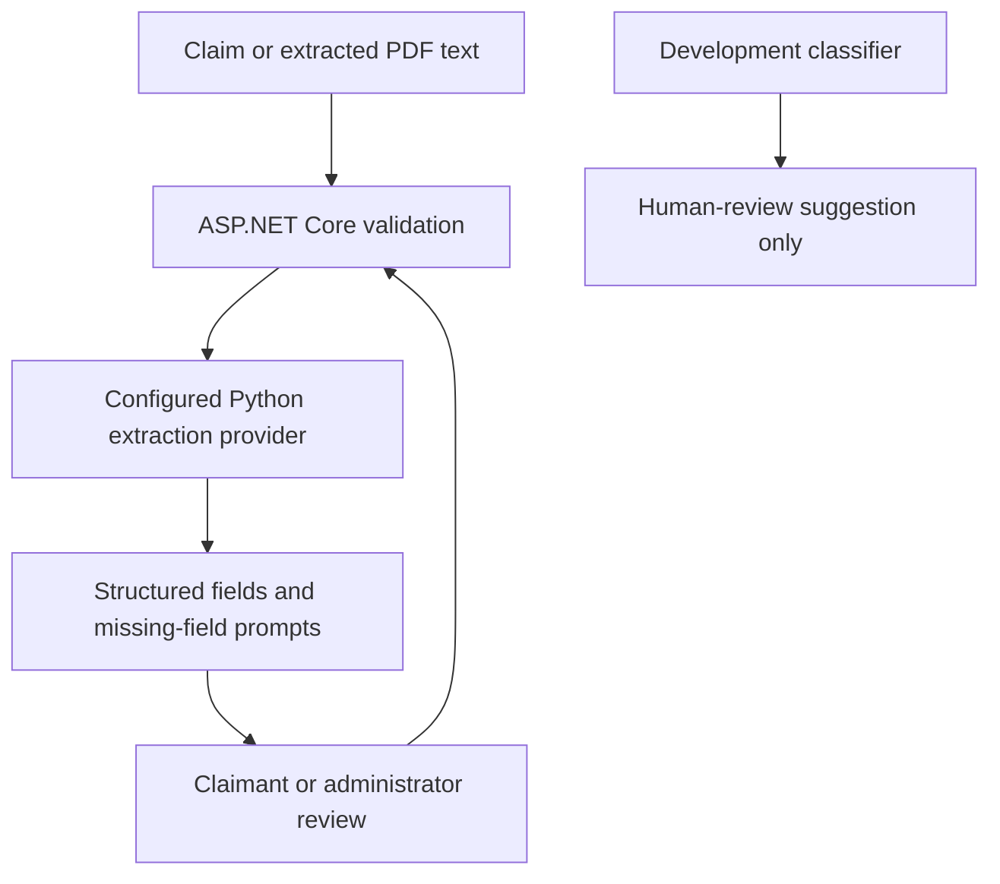

# Title Claim Intelligence Service

- This optional FastAPI service exposes structured text extraction and a development classifier. It has no database connection and cannot create, authorize, or update a claim; ASP.NET Core remains the source of truth.



The .NET application uses this provider only when explicitly configured with `AiService:Provider=Python`; otherwise it uses deterministic extraction. The Python classifier is not connected to live triage. Its small synthetic holdout scored 0.40 and does not support real-world quality claims or legal decisions.

## Local Test

From the repository root:

```powershell
Push-Location .\TitleClaimTracker\IntelligenceService
python -m venv .venv
.\.venv\Scripts\python.exe -m pip install -e ".[server,test]"
.\.venv\Scripts\python.exe -m pytest -q -p no:cacheprovider
Pop-Location
```

To run locally, train a development artifact from the reviewed synthetic fixture and bind Uvicorn to loopback only:

```powershell
Push-Location .\TitleClaimTracker\IntelligenceService
.\.venv\Scripts\python.exe -m title_claim_intelligence.training --output .\artifacts --seed 42
$env:TCT_MODEL_ARTIFACT = (Resolve-Path .\artifacts\classifier.joblib).Path
$env:TCT_MODEL_VERSION = 'development-fixture'
.\.venv\Scripts\uvicorn.exe title_claim_intelligence.app:app --host 127.0.0.1 --port 8010
Pop-Location
```

Joblib model artifacts are executable Python serialization; load only trusted files. Do not expose this development service publicly. Request bodies are limited to 5,000 characters and are not persisted by the service.

## Endpoints

- `GET /health` reports service readiness and classifier-artifact availability.
- `POST /api/v1/extract` returns explicitly extracted fields and missing-field prompts.
- `POST /api/v1/classify` returns a human-review suggestion and requires a trusted model artifact; otherwise it returns `503`.

The .NET client validates extraction responses and falls back to local deterministic extraction when the optional service is unavailable.
