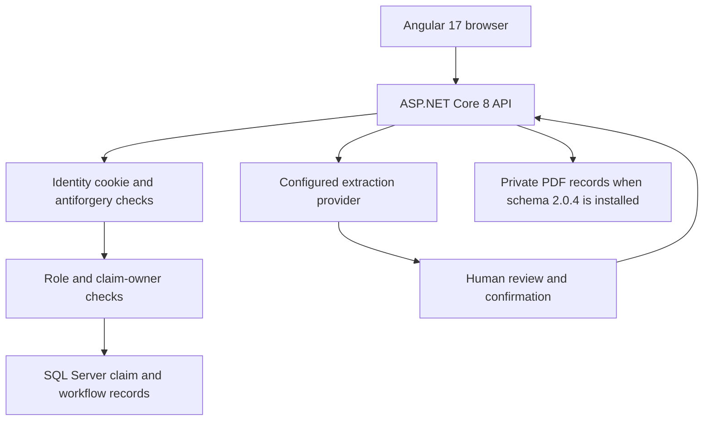

# Application Guide

The application uses Angular for the browser experience and ASP.NET Core for authentication, claim ownership, validation, audit, and persistence. SQL Server remains managed by reviewed scripts; the API does not migrate or create schema at startup.



The ownership check ensures claimants see their own active claims and administrators can review active claims across accounts. Claimant responses omit classification, risk, and priority scores. Administrators can see those internal scores, which are model/heuristic outputs rather than legal correctness probabilities.

## Run Locally

Follow the repository [README](../README.md) for the current ports and full local test sequence. Configure `ConnectionStrings__DefaultConnection` outside source control, then run:

```powershell
dotnet run --project .\TitleClaimTracker\ClaimTracker\TitleClaimTracker.csproj
Push-Location .\TitleClaimTracker\ClientApp
npm ci
npm start
Pop-Location
```

The API launch profile uses HTTPS port `58021` and HTTP port `58022`; Angular serves at `http://localhost:4200`. The Angular proxy targets the API HTTPS port.

## Main Workflows

- Claimants register, submit an intake draft, confirm it, and manage their own claim records.
- Administrators review claims, make allowed status changes, inspect audit history, and view cross-account analytics.
- Claimants and administrators can list and download PDFs attached to claims they may access. Upload and document analysis require the manual 2.0.4 schema upgrade.
- Administrators can analyze selectable PDF text. The extraction provider is configurable; the default is deterministic. Scanned PDFs are not OCR-processed.
- The optional Python service returns structured suggestions only. It does not create claims or connect its classifier to live triage.

## Verify Changes

```powershell
dotnet test .\TitleClaimTracker.Tests\Backend\TitleClaimTracker.Tests.csproj
Push-Location .\TitleClaimTracker\ClientApp
npm run build
Pop-Location
```

Backend tests use EF Core InMemory and mocks, not the development SQL database. Two legacy Selenium smoke tests remain skipped because they require an independently running application and browser driver. Database upgrade steps are in [DatabaseSetup.md](../TitleClaimTracker/Database/DatabaseSetup.md).
