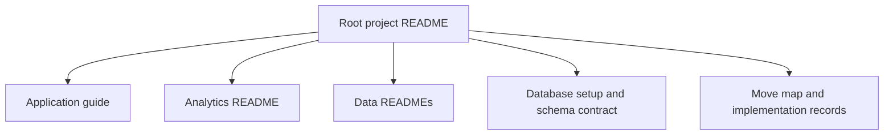

# Documentation Guide

The root [README](../README.md) is the short project overview and local test guide. This folder contains application notes, data-generation instructions, architecture records, and repository history.

The links group the documentation by the system boundary they explain, so local testing starts at the root guide while optional data and SQL workflows stay in their own runbooks.

- [Application Guide](ClaimTracker_readme.md) describes API ownership, local ports, claimant/admin workflows, and tests.
- [Implementation Summary](ImplementationChecklist.md) records current features, checks run, and remaining validation.
- [Analytics README](../TitleClaimTracker/Analytics/README.md) explains the live dashboard and separate synthetic and SQL/PySpark paths.
- [Data overview](../TitleClaimTracker/Data/README.md) distinguishes public, ML, and synthetic data.
- [Public ACRIS guide](../TitleClaimTracker/Data/Public/README.md) covers bounded downloads, validation, optional imports, and Spark preparation.
- [Synthetic portfolio guide](Synthetic_readme.md) explains the fixed-seed generator; [sample files](Synthetic_Samples_readme.md) describes checked-in fixtures.
- [Database setup](../TitleClaimTracker/Database/DatabaseSetup.md) and [schema contract](../TitleClaimTracker/Database/SchemaContract.md) are the operational SQL references.
- [Move map](MoveMap.md) records repository structure decisions. [File inventory](FileInventory.md) records the earlier reorganization audit.
