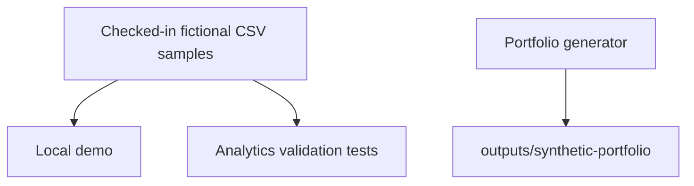

# Synthetic Sample Files

# Synthetic Sample Files

These checked-in CSV files contain a small fictional portfolio for local demos and analytics tests. They are not application claims, public ACRIS rows, or real people.



Checked-in samples support repeatable examples; newly generated files use a separate output directory so they do not silently replace the reviewed fixtures or change dashboard data.

Generate fresh files from the repository root:

```powershell
.\TitleClaimTracker\scripts\New-SyntheticPortfolioData.ps1 -Seed 42 -Count 24
```

See [Synthetic Portfolio Data](Synthetic_readme.md) for generated file names and options.