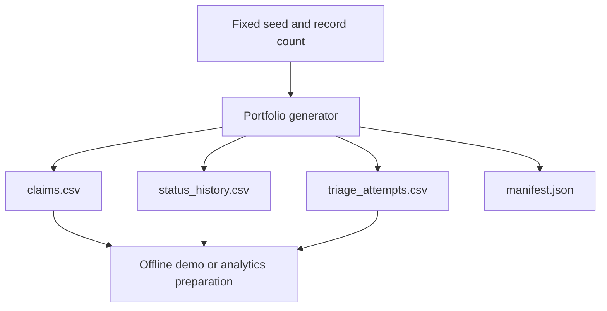

# Synthetic Portfolio Data

# Synthetic Portfolio Data

The generator creates fictional claim, status-history, and triage-attempt records for demos and offline analytics. It does not read application or ACRIS records and does not write to SQL Server.



The separate CSV outputs preserve claim-level, event-level, and attempt-level grain so they can be reviewed without mixing unlike records.

Run from the repository root:

```powershell
.\TitleClaimTracker\scripts\New-SyntheticPortfolioData.ps1 -Seed 42 -Count 24
```

Outputs go to `outputs/synthetic-portfolio/` by default. The same seed and count reproduce fixture records; `GeneratedUtc` changes on each run. Use `-OutputDirectory` to select another destination. Review outputs before publishing, including to Tableau Public.